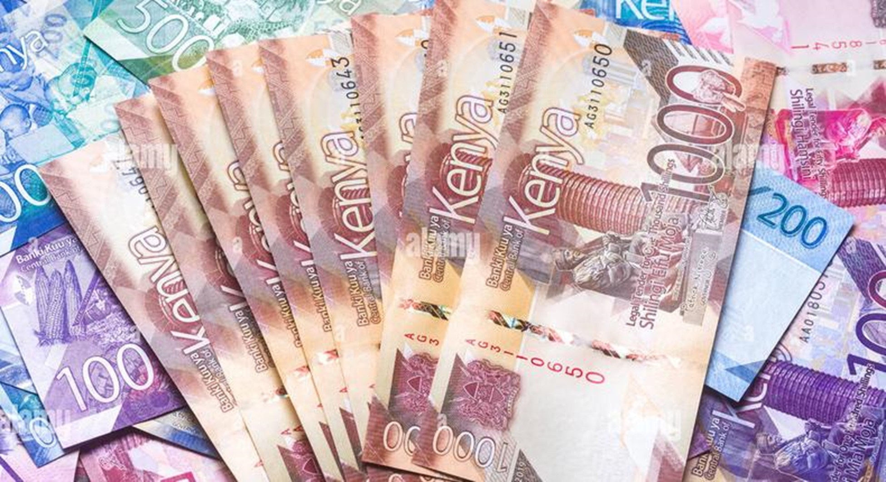
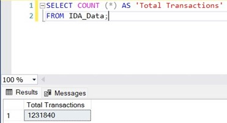
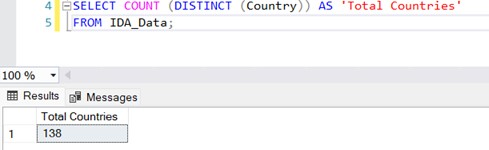
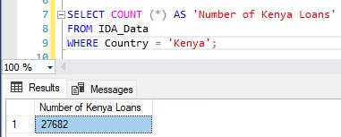

**Analyzing World Bank Data**

The World Bank is an organization which serves as a resource for developing nations to gain financing, new ideas, and other forms of aid. Their main goals are to end poverty and to increase prosperity. The organization was founded in 1944 and has over 170 member countries.

The organization posts a dataset on their website containing snapshots of the IDA Statement of Credits and Grants. I plan to analyze a version of the data which was last updated on November 14, 2023 using SQL.

I strive to answer the following questions:

- How many total transactions were made within this dataset?

- What is the largest loan that Kenya received? Is it the largest of all countries? If not, which country has the largest loan and why?

- How many loans did Kenya receive, and how does this compare to all other countries on the list?

- What was the average amount among all transactions that Kenya paid back to the World Bank?

The dataset is located [here](https://finances.worldbank.org/Loans-and-Credits/IDA-Statement-Of-Credits-and-Grants-Historical-Dat/tdwh-3krx/about_data), and includes a data dictionary with a description of each column.

To start to analyze this dataset, I first exported the CSV file. On a Microsoft SQL Server 2022 instance running on Docker, I created a new database and used the Import Flat File wizard to import the CSV file. For the data to properly import, I modified the database schema by adjusting the data types of some of the columns. Null values were also allowed for the Last_Disbursment_Data column.

Note that all values listed below are in US Dollars.

First, I wanted to confirm the total number of transactions in the entire dataset. I used the COUNT function to count all the rows of the table:

The data has 1,231,840 transactions. I also wanted to see how many different countries the loans were issued to. I used the COUNT function to count the number of distinct countries which appears throughout the data:

The data covers transactions from 138 different countries.

As one of the more populus countries in Africa at 47.6 million people, I wanted to take a closer look at some of the data from Kenya to see the value of the largest loan that the country received.

First, I queried the number of loans reported from Kenya:

There are 27,682 loans, which is just over 2% of the loans recorded in this dataset.

I then used the following statement below to find the 5 largest loans in the dataset: 

The largest loan that Kenya took out is $780,555,200. To compare, I wanted to find which country had the largest loads out of the entire dataset:

By far, it is safe to say that Ukraine has taken out the largest loans, the largest being valued at $1,043,624,512. Given the effective dates of 6/18/22 of the top 5 loans, these loans are more than likely to aid Ukraine a few months during the onset of the Russia-Ukraine war in the first half of 2022, coming from the World Bank's PEACE in Ukraine project ([link](https://www.worldbank.org/en/country/ukraine/brief/peace)).

What about total number of Transactions? Due to reasons above Ukraine still leads, however Kenya is not far behind at #3:

Finally, I wanted to check what was the average amount Kenya repaid back to the World Bank. I used the below query to do so, using an Average function to do so and filtering by only transactions for Kenya:

On average, Kenya repaid $8,339,482.79 back per transaction.

To conclude, let's look at the bigger picture: Kenya is one of the top countries who uses the World Bank, with over 27,000 transactions recorded in this dataset out of 1.2 million total. Kenya's largest loan is over $780 million.

More information on how the World Bank supports Kenya can be found [here](https://www.worldbank.org/en/country/kenya/overview). The World Bank aims to make Kenya's economy more resilient and improve the lives of its citizens.