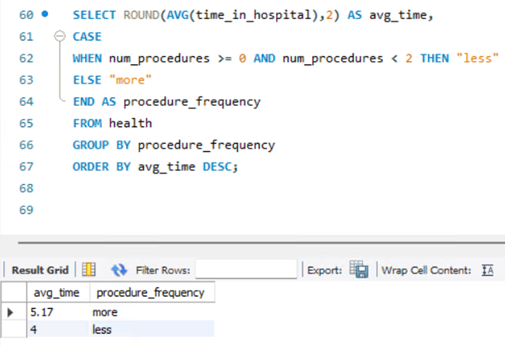
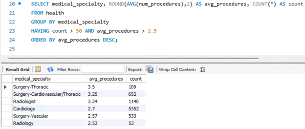
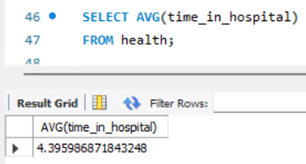
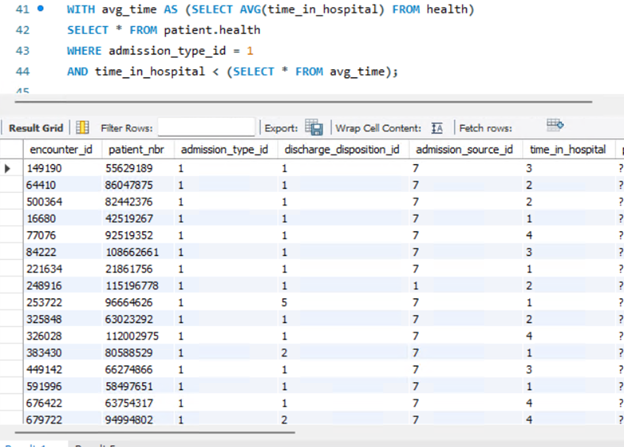

# Healthcare Analysis: Data Trends for Diabetic Hospital Patients

According to the CDC, there is an estimated 11-12% of the United States population who is projected to have diabetes, with the prevalence of the disease increasing over time. Because of this, data analysis plays an important role in making sure those who are diabetic and are hospitalized have positive outcomes for whatever procedures or treatments they are receiving.

In this project, I use SQL to extract valuable insights on hospital inpatient visits for diabetic patients. The [dataset is here](https://archive.ics.uci.edu/dataset/296/diabetes+130-us+hospitals+for+years+1999-2008), and contains data from 1999-2008 of inpatient hospital visits covering 130 hospitals in the United States. There are a total of 101,766 encounters recorded. During each visit, the admission lasted between 1 and 14 days, laboratory tests were performed, and medication was administered. The dataset was imported into a MySQL server for this analysis.

My goal in this analysis is to uncover any trends or patterns in the data which we can present to a healthcare decision maker who may be able to help improve patient outcomes. I strive to answer the following questions and requests:

- Are more lab procedures done for different races?
- Is there a correlation between the number of procedures performed in a hospital visit versus the length of the stay?
- Which medical specialties have a higher procedure count?
- Provide a list of patients in the dataset who are African-American, are taking Rosiglitazone, and had their dosage decreased during their visit.
- Provide a list of all patients whose visit was less than the average stay of the dataset.

## Lab Procedures and Race

First, I wanted to use the dataset to examine if there is any correlation between race and the number of lab procedures during a stay. Below, I used `ROUND`, `AVG`, `GROUP BY`, `ORDER BY` functions, and an `INNER JOIN` among the two tables in the dataset to pull and format this data:

There does not seem to be a large amount of variance with the number of lab procedures performed by race – all seemed to vary between 41-44 procedures per visit, meaning that there appears to essentially be an equal number of procedures being performed across the board.

## Procedures and Length of Stay

Next, we will explore if there is a correlation between the number of procedures performed in a hospital visit versus the length of the stay. I used `CASE` and `ELSE` statements to see if there is a relationship.

First, I wanted to see what the minimum and maximum number of procedures were amongst all visits in the data:

We can see that each encounter had between 0 and 6 procedures performed, with an average number of procedures between 1 and 2.

Using the average number of procedures as a baseline, I pulled together a table to show individual encounters and the number of procedures. I also indicated if each encounter had less or more than the average amount of procedures:

I then ran a query to see if the average time (in days admitted) to see if those with more than the average amount of procedures spent longer in the hospital:

This is true – those who underwent 2 or more procedures spent on average 1 day longer in the hospital.

## Medical Specialties and Procedure Count

Next up, how would we use the data to find which medical specialties have a higher procedure count per visit? To do this, I used the below statement to query the specialties which have greater than 50 procedures performed within the dataset, as well as those with an average procedure count greater than 2.5:

Thoracic surgery has the highest number of procedures performed on average per encounter, followed by Cardiovascular/Thoracic surgery and then Radiology.

## List of African American Patients with Decreased Rosiglitazone Dosage

In our next scenario, we need to gather a list of African American patients who had their rosiglitazone dosage lowered during their hospital visit. Rosiglitazone is a medication used to treat type 2 diabetes. I used a `UNION` operator to bring the data together from the two tables to gather this list:

## List of Patients with Shorter Than Average Stay

Next up, I wanted to use the data to produce a list of encounters where the visit was less than the average length of stay. To do this, I combined a `WITH` clause with a subquery to gather a list of patients whose visit was shorter than the average visit of 4.4 days.

## List of Top 50 Patients by Medication Count

Finally, I wanted to display a list of 50 patients who took the highest number of medications during their visit. To display them in order, I first used an `ALTER TABLE` statement to convert the “num_medications” table from varchar to integer in order for the medication counts to properly display in descending order:

I then used the below script using the `CONCAT_WS` to add a series of strings together to form a sentence displaying the patient number, their race, whether they were readmitted, and listing the number of medications and lab procedures. Instead of a table, this allows us to display the data in full sentences.

## Final Thoughts

To answer some of our initial questions: There is no obvious correlation between race and the number of lab procedures completed. For the number of operational procedures, there are more completed during an encounter the longer the visit is. Out of the number of procedures completed, Thoracic Surgery has the highest amount from the dataset. We were also able to successfully provide the requested patient lists.

We can use this data effectively to assist hospitals to provide better outcomes to their diabetic patients. What would be beneficial for patients would be to reduce the length of each stay. This can be done by only performing necessary procedures, and re-allocating resources so patients do not wait as long to be discharged.
